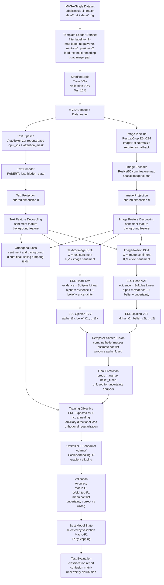

# Diagram Alur Implementasi MSA EDL

Dokumen ini menjelaskan alur implementasi notebook `claude_msa_edl.ipynb` untuk analisis sentimen multimodal MVSA-Single menggunakan RoBERTa, ResNet50, feature decoupling, bi-directional cross-attention, Evidential Deep Learning, dan Dempster-Shafer fusion.

## Diagram Mermaid

## Penjelasan Alur

1. **Dataset dan preprocessing awal**
   Dataset MVSA-Single dimuat dari `labelResultAllFinal.txt` dan folder `data`. Template loader yang sudah ada membersihkan pasangan label teks-gambar yang saling bertentangan, memetakan label ke tiga kelas, membaca file teks dengan beberapa opsi encoding, dan membuat `image_path` untuk setiap sampel.

2. **Split dan DataLoader**
   Data dibagi secara stratified menjadi train, validation, dan test dengan rasio 80:10:10. `MVSADataset` menghasilkan `input_ids`, `attention_mask`, tensor gambar, label, dan `sample_id`. Pipeline gambar memakai transform train/eval terpisah, termasuk normalisasi ImageNet dan fallback zero tensor bila gambar gagal dibaca.

3. **Ekstraksi fitur unimodal**
   Modalitas teks diproses oleh `roberta-base` dan memakai `last_hidden_state` sebagai token teks. Modalitas gambar diproses oleh ResNet50 hingga feature map konvolusional, lalu feature map diubah menjadi token spasial gambar. Kedua modalitas diproyeksikan ke dimensi bersama agar dapat diproses oleh attention layer yang sama.

4. **Feature decoupling**
   Setiap modalitas dipisahkan menjadi fitur sentimen dan fitur background menggunakan MLP terpisah. Fitur sentimen diteruskan ke cross-attention, sedangkan fitur background digunakan untuk regularisasi orthogonal. Tujuannya adalah mengurangi noise dan mendorong model menangkap sinyal sentimen yang lebih bersih.

5. **Bi-directional Cross-Attention**
   Model memakai dua arah attention. Pada alur Text-to-Image, token sentimen teks menjadi query untuk menyoroti token sentimen gambar. Pada alur Image-to-Text, token sentimen gambar menjadi query untuk menyoroti token sentimen teks. Dua arah ini membantu model membaca hubungan multimodal tanpa memaksa salah satu modalitas selalu dominan.

6. **Evidential Deep Learning**
   Setiap alur attention masuk ke EDL head satu kali. EDL head menghasilkan evidence non-negatif dengan `Softplus`, lalu membentuk parameter Dirichlet `alpha = evidence + 1`. Dari `alpha`, model menghitung belief dan uncertainty untuk masing-masing alur tanpa melakukan manual feature gating ulang.

7. **Dempster-Shafer fusion**
   Dua opini evidential dari alur Text-to-Image dan Image-to-Text digabung menggunakan Dempster-Shafer fusion. Fusion ini menghitung massa belief gabungan, uncertainty gabungan, dan konflik antar alur, sehingga pembobotan berbasis ketidakpastian terjadi pada tahap fusion. Prediksi akhir diambil dari kelas dengan `belief_fused` tertinggi.

8. **Loss dan optimisasi**
   Training memakai EDL Expected MSE sebagai loss klasifikasi utama, KL divergence dengan annealing untuk mengontrol evidence berlebihan, auxiliary loss untuk dua directional head, serta orthogonal loss kecil untuk menjaga decoupling. Optimizer menggunakan AdamW, scheduler menggunakan CosineAnnealingLR, dan training loop memakai gradient clipping.

9. **Evaluasi**
   Evaluasi mencatat accuracy, Macro-F1, Weighted-F1, mean conflict, serta rata-rata uncertainty pada prediksi benar dan salah. Test evaluation menampilkan classification report, confusion matrix, dan distribusi uncertainty agar performa model dapat dianalisis dari sisi akurasi dan kalibrasi ketidakpastian.

## Ringkasan Output Model

`DecoupledBCAEDL.forward(...)` mengembalikan output utama berikut:

- `alpha_t2v`, `belief_t2v`, `u_t2v`: opini evidential dari alur Text-to-Image.
- `alpha_v2t`, `belief_v2t`, `u_v2t`: opini evidential dari alur Image-to-Text.
- `alpha_fused`, `belief_fused`, `u_fused`: opini final setelah Dempster-Shafer fusion.
- `preds`: prediksi kelas akhir berdasarkan `belief_fused`.
- `orthogonal_loss`: regularisasi feature decoupling.
- `conflict`: estimasi konflik antara dua alur evidential.
